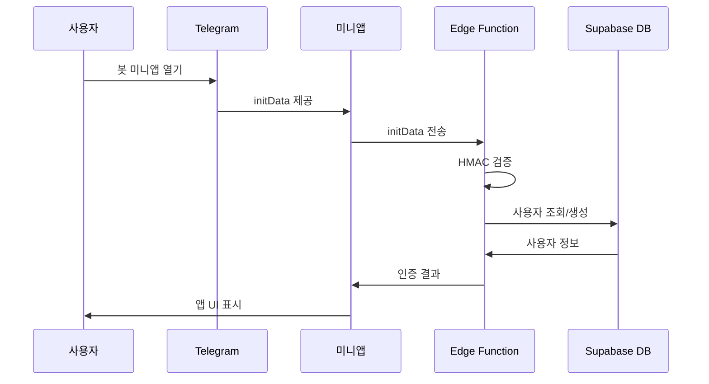

# Fragmetric Telegram Mini App


Fragmetric은 Telegram Mini App 플랫폼을 위한 게임 및 소셜 경험을 제공하는 프로젝트입니다. 사용자는 클리커 게임을 플레이하고, SOL 가격 예측 베팅에 참여하며, 리더보드를 통해 친구들과 경쟁할 수 있습니다.

## 📋 목차

- [주요 기능](#주요-기능)
- [개발 과정 및 구현 내용](#개발-과정-및-구현-내용)
- [기술 스택](#기술-스택)
- [프로젝트 구조](#프로젝트-구조)
- [Supabase 연동 가이드](#supabase-연동-가이드)
- [Telegram 봇 및 미니앱 설정](#telegram-봇-및-미니앱-설정)
- [개발 시작하기](#개발-시작하기)
- [배포 가이드](#배포-가이드)
- [트러블슈팅](#트러블슈팅)

## 🎮 주요 기능

- **클리커 게임**:

  - 버튼을 탭하여 점수 획득
  - 애니메이션 효과로 탭 방향에 따라 버튼 기울임
  - 부스트 기능으로 일정 시간 점수 획득량 증가

- **SOL 가격 예측 베팅**:

  - 실시간 SOL 가격 차트 표시
  - UP/DOWN 베팅 시스템
  - 일일 베팅 제한 및 점수 보상

- **리더보드 시스템**:

  - 글로벌 및 친구 랭킹 비교
  - 다양한 필터링 옵션 (전체, 클리커, 베팅)
  - 사용자 순위 및 점수 표시

- **계정 및 태스크**:

  - 다양한 태스크 완료를 통한 보상 획득
  - 친구 초대 및 추천 시스템
  - 사용자 프로필 및 통계 관리

- **Telegram 통합**:

  - 원활한 Telegram 사용자 인증
  - 서버 측 검증을 통한 보안 강화
  - Telegram WebApp API 활용한 UI/UX 최적화

- **TON 지갑 연결**:
  - TON Connect를 통한 지갑 연결
  - 블록체인 기반 기능 구현 준비

## 📝 개발 과정 및 구현 내용

### 1. 프로젝트 설계 및 아키텍처

**목표**: 확장 가능하고 유지보수가 용이한 미니앱 구조 설계

**구현 내용**:

- **컴포넌트 기반 설계**: 재사용 가능한 컴포넌트로 UI 요소 분리
- **상태 관리**: Zustand를 사용하여 상태 관리 로직 모듈화
- **정적 내보내기**: API 라우트 없이 정적 사이트로 배포 가능한 구조 설계
- **다국어 지원**: next-intl을 사용한 i18n 구현

### 2. 게임 메커니즘 구현

**목표**: 흥미롭고 사용자 참여를 유도하는 게임 경험 제공

**구현 내용**:

- **클리커 게임**:

  - Framer Motion을 활용한 부드러운 애니메이션
  - 탭 방향에 따른 버튼 기울임 효과 (3D 변환)
  - 클릭 지점에 점수 애니메이션 표시
  - 부스트 시스템 및 쿨다운 메커니즘

- **베팅 시스템**:
  - lightweight-charts 라이브러리로 실시간 SOL 가격 차트 구현
  - 타임프레임 조절 기능 (1m, 5m, 15m, 1h, 4h, 1d)
  - 베팅 결과 처리 및 점수 계산 로직
  - 베팅 제한 및 쿨다운 메커니즘

### 3. 데이터 관리 및 백엔드 연동

**목표**: 확장 가능하고 신뢰성 있는 데이터 저장 및 관리 시스템 구축

**구현 내용**:

- **Supabase 통합**:

  - 사용자, 베팅, 태스크, 리더보드 데이터 관리
  - Edge Functions를 활용한 서버리스 백엔드 구현
  - RLS(Row Level Security)를 통한 데이터 접근 제어

- **상태 관리 최적화**:
  - Zustand 스토어 간 연동 및 최적화
  - 로컬 스토리지 지속성 구현
  - 서버-클라이언트 데이터 동기화

### 4. Telegram 통합 및 사용자 인증

**목표**: Telegram 플랫폼과의 원활한 통합 및 보안 인증 구현

**구현 내용**:

- **Telegram WebApp API 활용**:

  - 사용자 인터페이스를 Telegram 환경에 최적화
  - Telegram 테마에 맞는 UI 자동 조정

- **사용자 인증 시스템**:
  - HMAC-SHA256 서명을 통한 Telegram initData 검증
  - Telegram 사용자 정보 자동 등록 및 관리
  - 서버리스 환경에서 보안 인증 구현

### 5. UI/UX 디자인 및 최적화

**목표**: 직관적이고 반응성 높은 사용자 경험 제공

**구현 내용**:

- **반응형 디자인**:

  - 다양한 화면 크기에 최적화된 레이아웃
  - Tailwind CSS를 활용한 일관된 디자인 시스템

- **상태 피드백**:

  - 로딩 상태, 에러 처리, 성공 알림 구현
  - 애니메이션을 통한 자연스러운 상태 전환

- **성능 최적화**:
  - 코드 스플리팅 및 지연 로딩
  - 이미지 최적화 및 캐싱 전략

## 🛠️ 기술 스택

### 프론트엔드

- **Next.js 14**: 파일 기반 라우팅, 정적 생성, 서버 컴포넌트 지원
- **TypeScript**: 타입 안정성 및 개발 경험 향상
- **Tailwind CSS**: 유틸리티 우선 CSS 프레임워크로 빠른 UI 개발
- **Framer Motion**: 고성능 애니메이션 라이브러리
- **Telegram WebApp API**: Telegram 미니앱 환경과의 통합

### 상태 관리

- **Zustand**: 경량화된 상태 관리 라이브러리
- **next-intl**: 국제화 및 다국어 지원

### 백엔드 및 데이터

- **Supabase**: 백엔드 서비스 (데이터베이스, 인증, 스토리지)
- **Edge Functions**: 서버리스 함수 실행 환경
- **PostgreSQL**: 관계형 데이터베이스

### 외부 통합

- **TON Connect**: TON 블록체인 지갑 연결
- **Telegram Mini Apps SDK**: Telegram 플랫폼 통합
- **Telegram UI**: 미니앱 전용 UI 컴포넌트

### 개발 도구

- **ESLint**: 코드 품질 및 일관성 유지
- **pnpm**: 효율적인 패키지 관리
- **Docker**: 개발 환경 일관성 및 Edge Functions 개발

## 📁 프로젝트 구조

```
fragmetric-tg-miniapp/
├── public/                   # 정적 파일 디렉토리
│   └── telegram-web-app.html # Telegram 미니앱 진입점
├── src/
│   ├── app/                  # Next.js 앱 라우터
│   ├── components/           # 재사용 가능한 컴포넌트
│   │   ├── Account/          # 계정 관련 컴포넌트
│   │   ├── Betting/          # 베팅 관련 컴포넌트
│   │   ├── Clicker/          # 클리커 게임 컴포넌트
│   │   ├── Leaderboard/      # 리더보드 컴포넌트
│   │   └── TabBar/           # 탭 네비게이션 컴포넌트
│   ├── core/                 # 핵심 기능 모듈
│   │   └── i18n/             # 국제화 관련 설정
│   ├── hooks/                # 커스텀 React 훅
│   ├── lib/                  # 유틸리티 및 설정
│   ├── store/                # Zustand 스토어
│   └── types/                # TypeScript 타입 정의
├── supabase/
│   └── functions/            # Supabase Edge Functions
│       └── verify-telegram/  # Telegram 인증 검증 함수
├── .env.example              # 환경 변수 예제 파일
├── .env.local.example        # 로컬 환경 변수 예제 파일
├── next.config.mjs           # Next.js 설정
└── tsconfig.json             # TypeScript 설정
```

## ☁️ Supabase 연동 가이드

### 데이터베이스 테이블 구조

#### `users` 테이블

```sql
CREATE TABLE users (
  id TEXT PRIMARY KEY,
  username TEXT,
  first_name TEXT,
  last_name TEXT,
  created_at TIMESTAMP WITH TIME ZONE DEFAULT NOW(),
  clicker_score INTEGER DEFAULT 0,
  betting_score INTEGER DEFAULT 0,
  total_score INTEGER DEFAULT 0,
  daily_bets INTEGER DEFAULT 0,
  last_bet_reset TIMESTAMP WITH TIME ZONE DEFAULT NOW(),
  last_click_time TIMESTAMP WITH TIME ZONE DEFAULT NOW(),
  referral_code TEXT UNIQUE,
  referrer_id TEXT REFERENCES users(id),
  is_telegram_user BOOLEAN DEFAULT FALSE
);
```

#### `bets` 테이블

```sql
CREATE TABLE bets (
  id UUID PRIMARY KEY DEFAULT uuid_generate_v4(),
  user_id TEXT REFERENCES users(id),
  amount INTEGER DEFAULT 10,
  type TEXT CHECK (type IN ('UP', 'DOWN')),
  created_at TIMESTAMP WITH TIME ZONE DEFAULT NOW(),
  result TEXT CHECK (result IN ('WIN', 'LOSE', 'PENDING')) DEFAULT 'PENDING',
  score_earned INTEGER DEFAULT 0,
  sol_price_start NUMERIC NOT NULL,
  sol_price_end NUMERIC
);
```

#### `tasks` 테이블

```sql
CREATE TABLE tasks (
  id UUID PRIMARY KEY DEFAULT uuid_generate_v4(),
  title TEXT NOT NULL,
  description TEXT NOT NULL,
  reward INTEGER DEFAULT 10,
  task_type TEXT CHECK (task_type IN ('DAILY', 'SOCIAL', 'ONE_TIME'))
);
```

#### `user_tasks` 테이블

```sql
CREATE TABLE user_tasks (
  id UUID PRIMARY KEY DEFAULT uuid_generate_v4(),
  user_id TEXT REFERENCES users(id),
  task_id UUID REFERENCES tasks(id),
  completed BOOLEAN DEFAULT FALSE,
  completed_at TIMESTAMP WITH TIME ZONE,
  UNIQUE(user_id, task_id)
);
```

### Edge Function 설정

1. 환경 변수 설정:

```bash
# Telegram Bot Token
supabase secrets set TELEGRAM_BOT_TOKEN=your_telegram_bot_token

# Supabase 서비스 키 (주의: SUPABASE_ 접두사는 사용하지 마세요)
supabase secrets set SERVICE_ROLE_KEY=your_service_role_key

# Supabase URL
supabase secrets set PROJECT_URL=your_project_url
```

2. Edge Function 배포:

```bash
supabase functions deploy verify-telegram
```

### 보안 설정

1. Row Level Security (RLS) 정책:

```sql
-- 사용자 테이블 보안 정책
ALTER TABLE users ENABLE ROW LEVEL SECURITY;
CREATE POLICY "사용자는 자신의 데이터만 읽고 수정 가능" ON users
  USING (id = auth.uid())
  WITH CHECK (id = auth.uid());

-- 모든 사용자가 읽기 가능한 정책
CREATE POLICY "모든 사용자가 읽기 가능" ON users
  FOR SELECT USING (true);
```

2. API 권한 제한:

```sql
-- 익명 사용자의 직접 수정 방지
REVOKE UPDATE, DELETE ON users FROM anon;
```

## 📱 Telegram 봇 및 미니앱 설정

### 1. Telegram 봇 생성

1. [@BotFather](https://t.me/botfather)에서 `/newbot` 명령 실행
2. 봇 이름 및 사용자명 설정
3. 봇 API 토큰 저장 (`TELEGRAM_BOT_TOKEN`)

### 2. 미니앱 생성 및 설정

1. `/newapp` 명령으로 미니앱 생성
2. 앱 이름, 설명, 아이콘 설정
3. 웹 앱 URL 설정 (배포된 도메인 + `/telegram-web-app.html`)

### 3. 미니앱 인증 흐름

**작동 방식**:

1. 사용자가 Telegram에서 미니앱 실행
2. Telegram이 `initData` 제공 (사용자 정보, 인증 해시 포함)
3. 미니앱이 Edge Function으로 `initData` 전송
4. Edge Function이 HMAC-SHA256 서명으로 데이터 검증
5. 검증 성공 시 사용자 등록/로그인 처리



## 💻 개발 시작하기

### 환경 설정

1. 저장소 클론:

```bash
git clone https://github.com/yourusername/fragmetric-tg-miniapp.git
cd fragmetric-tg-miniapp
```

2. 의존성 설치:

```bash
pnpm install
```

3. 환경 변수 설정:

```bash
cp .env.local.example .env.local
# .env.local 파일 편집하여 실제 값 설정
```

### 개발 서버 실행

1. 일반 개발 서버:

```bash
pnpm dev
```

2. HTTPS 개발 서버 (Telegram 테스트용):

```bash
pnpm dev:https
```

### 코드 규칙 검사

```bash
pnpm lint
```

### 빌드 및 배포

1. 프로덕션 빌드:

```bash
pnpm build
```

2. 로컬에서 프로덕션 빌드 테스트:

```bash
pnpm start
```

## 🚀 배포 가이드

### 정적 사이트 배포 (권장)

이 프로젝트는 정적 사이트로 배포할 수 있습니다. `next.config.mjs` 파일에 다음 설정이 포함되어 있습니다:

```javascript
const nextConfig = {
  output: 'export',
  images: {
    unoptimized: true
  }
}
```

#### Vercel 배포

```bash
pnpm dlx vercel deploy --prod
```

#### Netlify 배포

```bash
pnpm dlx netlify deploy --prod
```

### Supabase Edge Functions 배포

```bash
# 필수: Supabase CLI 설치
npm install -g supabase

# 로그인 및 프로젝트 연결
supabase login
supabase link --project-ref your_project_id

# Edge Functions 배포
supabase functions deploy verify-telegram
```

### Telegram 미니앱 URL 등록

배포 후, BotFather에서 `/mybots` → 봇 선택 → Bot Settings → Menu Button → Web App URL 설정

URL 형식: `https://your-domain.com/telegram-web-app.html`

## 🔧 트러블슈팅

### 1. 빌드 오류 해결

#### Server Actions 관련 오류

오류 메시지: `Server Actions are not supported with static export.`

해결책:

```javascript
// 'use server' 지시문을 'use client'로 변경
// 서버 액션 대신 클라이언트 측 코드 사용
```

#### Supabase Edge Functions 관련 오류

오류 메시지: `Cannot find module 'https://deno.land/...'`

해결책:

```javascript
// next.config.mjs 파일에서 Edge Functions 디렉토리 제외
webpack: (config) => {
  config.module.rules.push({
    test: /supabase\/functions\/.*\.ts$/,
    loader: 'ignore-loader',
  });
  return config;
},
```

### 2. Telegram 인증 문제

#### initData 검증 오류

오류 메시지: `Invalid Telegram data`

해결책:

- BOT_TOKEN 값이 올바른지 확인
- 서명 생성 알고리즘 검토 (데이터 정렬, 해시 생성 방식)
- Edge Function 로그 확인

#### 환경 변수 설정 문제

오류 메시지: `Missing Supabase configuration`

해결책:

- Supabase Edge Function 환경 변수 확인:
  ```bash
  supabase secrets list
  ```
- Supabase 예약어 접두사(`SUPABASE_`) 사용 피하기

### 3. 기타 일반적인 문제

#### 개발 서버에서 Telegram WebApp 미작동

해결책:

- HTTPS 개발 서버 사용: `pnpm dev:https`
- Telegram WebApp API 모의 구현 사용 (개발 모드에서만)

#### 성능 최적화

- 이미지 최적화 및 지연 로딩 활성화
- 코드 스플리팅 구현
- API 요청 캐싱 및 재시도 로직 추가
